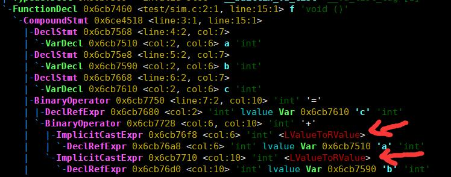
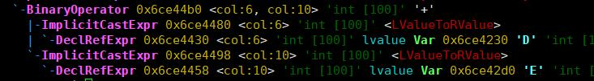
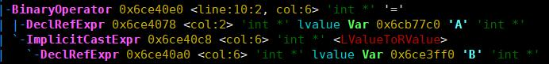

# 编译原理研讨课实验PR002实验报告

## 任务说明

### 任务要求

>1. `扩展AST的表示已支持element-wise的操作`

>2. `操作匹配：类型匹配（静态数组，类型相同），大小匹配（大小相等）`

>3. `生成合法的AST`

>4. `不破坏原有C语言代码的语义`

### 任务实现

通过修改`llvm-3-3/tool/clang/lib/Sema/SemaExpr.cpp`中的部分函数，完成对操作数的检查和匹配，并限定仅支持C语言标准的int类型的array.

## 成员组成

    段江飞，蔡昕，资威

## 实验设计

### 设计思路

* 编译器生成token流、进行语法分析之后，进行语义分析阶段。语义分析阶段，会调用`Sema::ActOnBinOp`函数对二元操作符进行分析，而`Sema::ActOnBinOp`函数会调用`Sema::BuildBinOp`函数进行二元操作符的创建，在`Sema::BuildBinOp`函数中，对于固定(bulit-in)的非重载的操作类型,需要调用`Sema::CreateBuiltinBinOp`函数来创建二元操作符。为了支持`elementWise`操作，我们需要在二元操作符是'='、'+'、'*' 且函数有`elementWise`标记的时候进行操作数的检查和匹配，所以本实验需要修改函数`Sema::CheckForModifiableLvalue`，`Sema::CheckAssignmentOperands`，`Sema::CheckAdditionOperands`，`Sema:CheckMultiplyDivideOperands`以达到实验目的。

* 语法树的构造  
  通过正常的两个int类型的加法可以看到，'+'的两个操作数都会有左值转化为右值的过程，所以对数组的elementWise的操作的设计可以类似这种操作。
  
  在合法性检查之后，对数组进行左值到右值的转化，然后利用clang已有的代码构造相应的AST树。
  
  

* '='操作  
  1. 检查左操作数是否assignable，在`Sema::CheckForModifiableLvalue`中修改使得带有elementWise标记的函数里的数组为assignable
  2. `Sema::CheckAssignmentOperands`中，检查函数是否有elementWise标记和右操作数是否是静态数组类型(左操作数在assignable的修改中已经检查)
  3. 检查数组的大小和元素类型是否匹配以及是否是int类型的数组
  4. '='的左操作数需要是lvalue，进行lvalue的检查，然后对右操作数根据需要进行lvalue到rvalue的转化

* '+'和'*'操作
  1. 检查左右操作数是否assignable，在`Sema::CheckForModifiableLvalue`中修改使得带有elementWise标记的函数里的数组为assignable
  2. `Sema::CheckAssignmentOperands`中，检查函数是否有elementWise标记和右操作数是否是静态数组类型(左操作数在assignable的修改中已经检查)
  3. 检查数组的大小和元素类型是否匹配以及是否是int类型的数组
  4. 对左右操作数进行检查，将其中是lvalue的操作数转化为rvalue

 

### 具体实现

`Sema::CheckForModifiableLvalue` 的添加部分
```c
  if(IsLV == Expr::MLV_ArrayType && S.IsElementWise &&
    ConstantArrayType::classof(E->getType().getTypePtr()))
    return false;
```
`Sema::CheckAssignmentOperands` 的添加部分：
```c

  //handle the case: unqualified array '='
  //check if this function support elementwise and RHS'type is ConstantArray
  if(this->IsElementWise && RHSType.getTypePtr()->isConstantArrayType())
  {
    const ConstantArrayType *lhs = dyn_cast<ConstantArrayType>(LHSType.getTypePtr());
    const ConstantArrayType *rhs = dyn_cast<ConstantArrayType>(RHSType.getTypePtr());
    QualType lhs_dt = lhs->getElementType().getUnqualifiedType();
    QualType rhs_dt = rhs->getElementType().getUnqualifiedType();
    //check whether LHS and RHS have same size and type and make sure type of array is int  
    if(lhs->getSize() == rhs->getSize() && lhs_dt == rhs_dt && \
        lhs_dt.getTypePtr()->isIntegerType())
    {
    // check whether LHSexpr is lvalue
      if(LHSExpr->isLValue())
      {
    //if RHSexpr is not of rvalue kind ,transfer RHSCheck to rvalue kind for  assignment and building AST
    
        if(!(RHSCheck->isRValue()))
        {
          Qualifiers tmp;
          ImplicitCastExpr *rhs_r2l = ImplicitCastExpr::Create(Context, 
            Context.getUnqualifiedArrayType(RHSType.getUnqualifiedType(), tmp),
            CK_LValueToRValue, RHSCheck, 0, VK_RValue);
          RHS = rhs_r2l;
        }
      }
      
      return LHSType;
    }
  }
```
`Sema::CheckAdditionOperands`的添加部分：
```c
  //handle the case: unqualified array '+'
  //check whether this function support elementwise and LHS's and RHS'type is ConstantArray
  if(this->IsElementWise && LHS.get()->getType().getTypePtr()->isConstantArrayType() &&
    RHS.get()->getType().getTypePtr()->isConstantArrayType())
  {
    const ConstantArrayType *lhs = dyn_cast<ConstantArrayType>(LHS.get()->getType().getTypePtr());
    const ConstantArrayType *rhs = dyn_cast<ConstantArrayType>(RHS.get()->getType().getTypePtr());
    QualType lhs_dt = lhs->getElementType().getUnqualifiedType();
    QualType rhs_dt = rhs->getElementType().getUnqualifiedType();
    //check whether LHS and RHS have same size and type and make sure type of array is int 
    if(lhs->getSize() == rhs->getSize() && lhs_dt == rhs_dt &&
      lhs_dt.getTypePtr()->isIntegerType())
    {
    //if LHS or RHS is not of rvalue kind ,transfer it to rvalue kind for further addition compution  
      if(!(LHS.get()->isRValue()))
      {
        Qualifiers tmp;
        ImplicitCastExpr *lhs_r2l = ImplicitCastExpr::Create(Context, 
          Context.getUnqualifiedArrayType(LHS.get()->getType().getUnqualifiedType(), tmp),
          CK_LValueToRValue, LHS.get(), 0, VK_RValue);
        LHS = lhs_r2l;
      }
      if(!(RHS.get()->isRValue()))
      {
        Qualifiers tmp;
        ImplicitCastExpr *rhs_r2l = ImplicitCastExpr::Create(Context, 
          Context.getUnqualifiedArrayType(RHS.get()->getType().getUnqualifiedType(), tmp),
          CK_LValueToRValue, RHS.get(), 0, VK_RValue);
        RHS = rhs_r2l;
      }
      return LHS.get()->getType();
    }
  }
```

`Sema:CheckMultiplyDivideOperands`的添加部分：
```c
  //handle the case: unqualified array '*'
  //check whether this function support elementwise and LHS's and RHS'type is ConstantArray (only for multiply)
  if(!IsDiv && !IsCompAssign && this->IsElementWise &&
    LHS.get()->getType().getTypePtr()->isConstantArrayType() &&
    RHS.get()->getType().getTypePtr()->isConstantArrayType() )
  {
    const ConstantArrayType *lhs = dyn_cast<ConstantArrayType>(LHS.get()->getType().getTypePtr());
    const ConstantArrayType *rhs = dyn_cast<ConstantArrayType>(RHS.get()->getType().getTypePtr());
    QualType lhs_dt = lhs->getElementType().getUnqualifiedType();
    QualType rhs_dt = rhs->getElementType().getUnqualifiedType();
  //check whether LHS and RHS have same size and type and make sure the type of array is int 
    if(lhs->getSize() == rhs->getSize() && lhs_dt == rhs_dt &&
      lhs_dt.getTypePtr()->isIntegerType())
    {
      //if LHS or RHS is not of rvalue kind ,transfer it to rvalue kind for further compution
      if(!(LHS.get()->isRValue()))
      {
        Qualifiers tmp;
        ImplicitCastExpr *lhs_r2l = ImplicitCastExpr::Create(Context, 
          Context.getUnqualifiedArrayType(LHS.get()->getType().getUnqualifiedType(), tmp),
          CK_LValueToRValue, LHS.get(), 0, VK_RValue);
        LHS = lhs_r2l;
      }
      if(!(RHS.get()->isRValue()))
      {
        Qualifiers tmp;
        ImplicitCastExpr *rhs_r2l = ImplicitCastExpr::Create(Context, 
          Context.getUnqualifiedArrayType(RHS.get()->getType().getUnqualifiedType(), tmp),
          CK_LValueToRValue, RHS.get(), 0, VK_RValue);
        RHS = rhs_r2l;
      }
      return LHS.get()->getType();
    }
  }
  ```
  ## 测试过程
使用了两个测试文件进行测试，首先是老师任务书给出的测试文件sim-full.c
```c
#pragma elementWise
void foo1(){
	int A[1000];
	int B[1000];
	int C[1000];
	int *D;
	int E[10][100];
	C = A + B;
	C = A * B;
	C = A;

	C = D;
	
	(A + B) = C;

	C = A + D;
	C = D + A;
	C = D + D;

	E = A;
	E = A + B;
	E = A * B;
}

void foo2(){
	int A[1000];
	int B[1000];
	int C[1000];
	C = A + B;
	C = A * B;
	C = A;
}

#pragma elementWise
void foo3(){
	int A[1000];
	int B[1000];
	const int C[1000];
	C = A;
	C = A + B;
}

#pragma elementWise
void foo4(){
	int A[1000];
	const int B[1000];
	int C[1000];
	C = B;
	C = A + B;
}

#pragma elementWise
void foo5(){
	int A[1000];
	int B[1000];
	int C[1000];
	int D[1000];
	D = A + B + C;
	D = A * B + C;
	D = (D = A + B);
	D = (A + B) * C;
	D = (A + B) * (C + D);
}

```
其测试结果和老师任务书上显示的是一致的，为了方便起见我就只把最后foo5的AST贴出来：

  上图的式子可以看出来依次是D = A + B + C; D = A * B + C; D = (D = A + B);

  上图的式子可以看出来依次是D = (A + B) * C;D = (A + B) * (C + D);

然后老师课上说过要只支持int，然后还不能支持除法，我们用下面的程序测试了：
```c
#pragma elementWise
void foo1(){
	float A[1000];
	float B[1000];
	float C[1000];
	C = A + B;
	C = A * B;
	C = A;
}

#pragma elementWise
void foo2(){
	int A[1000];
	int B[1000];
	int C[1000];
	C = A / B;
	C = A + B;
	C = A * B;
	C = A;
}

int main(){
	return 0;
}
```
测试结果是：

可以看到使用float类型的和使用除法的都报错了。

可以看到使用加法、乘法、赋值操作的正确生成了AST树。
  ## 总结

  ### 实验结果总结
    经过测试，实验结果能够满足任务书中支持C语言标准的int类型的elementWize操作，检查操作匹配以及生成合法的AST的要求，并且不会破坏原有C语言代码的语义。
  ### 分成员总结
    段江飞：'+'、'='、'*'代码实现
    资  威：'*'代码实现，测试
    蔡  昕：代码注释及实验报告编写
